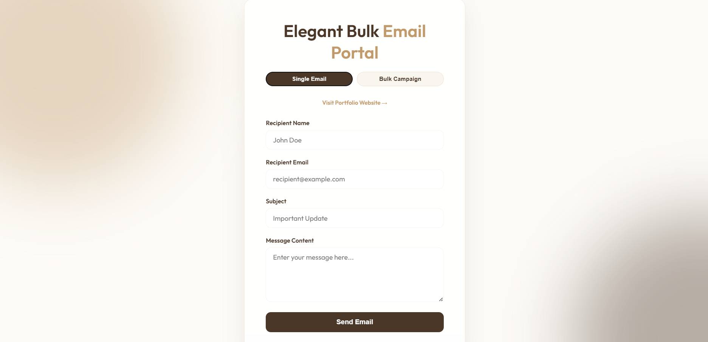

# 🪶 Elegant Bulk Email Portal
### PALLAVI PATEL | AI BACKEND DEVELOPER

[](https://github.com/pallavi-patel-developer/Bulk-Email-Send)
[](https://github.com/pallavi-patel-developer/Bulk-Email-Send)

Welcome to the **Premium Email Outreach Portal**. This system is designed for elite professionals who demand both aesthetic excellence and extreme functional efficiency. 

---

## 📸 System Glimpses

<table border="0">
  <tr>
    <td width="33%"></td>
    <td width="33%"></td>
    <td width="33%"></td>
  </tr>
  <tr>
    <td align="center"><b>Single Outreach</b></td>
    <td align="center"><b>Bulk Campaign</b></td>
    <td align="center"><b>CSV Management</b></td>
  </tr>
</table>

---

##  Features

- **Luxury Aesthetic**: A curated Brown and White palette with Gold accents for a premium professional feel.
- **Bulk Automation**: Send 40+ personalized emails in seconds using integrated CSV parsing.
- **Real-time Editing**: Refine salon names and prune lead lists directly in the dashboard before launching.
- **Smart Tracking**: Live status updates for every email sent, tracking successes and errors in real-time.
- **Project Safety**: Pre-configured protection for environment variables and dependencies.

---

## 🛠️ Technology Stack

- **Backend**: Node.js & Express
- **Outreach**: Nodemailer (Gmail Secure Authentication)
- **Frontend**: Vanilla JS, HTML5, CSS3 (Glassmorphism)
- **Data**: PapaParse (High-speed CSV Processing)

---

##  Quick Start

1. **Clone & Install**:
   ```bash
   git clone https://github.com/pallavi-patel-developer/Bulk-Email-Send.git
   npm install
   ```

2. **Configure Environment**:
   Create a `.env` file with your credentials:
   ```env
   EMAIL_USER=your-email@gmail.com
   EMAIL_PASS=your-app-password
   ```

3. **Launch**:
   ```bash
   node server.js
   ```

---

##  Contact & Portfolio
Designed and Developed by **Pallavi Patel**.  
[Visit Full Portfolio](https://salon-eight-rho.vercel.app/)

---
<p align="center">© 2026 Elegant Bulk Email Portal | Crafted for Excellence</p>
